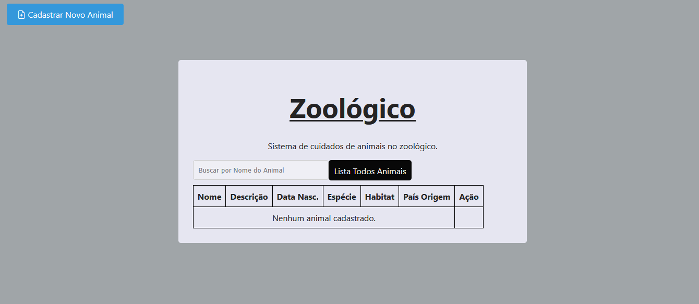

# Projeto React + ASP .NET

Desenvolvido com React no frontend e ASP .NET no backend. Utiliza o Bootstrap para ícones e o SweetAlert para mensagens de alerta. O banco de dados utilizado é o SQL Server (nome "master"), e as migrations foram configuradas.
Esse projeto foi desenvolvido para um teste seletivo, tem como base o cadastro e cuidados de animais no zoológico.
## Tecnologias Utilizadas

- **Frontend**: React
- **Backend**: ASP .NET
- **Banco de Dados**: SQL Server (nome "master")
- **Estilo**: Bootstrap
- **Mensagens de Alerta**: SweetAlert

## Instalação

### Backend (ASP .NET)

1. Clone o repositório:
   ```bash
   git clone https://link-para-o-repositorio.git

## Rodando as Migrations e subindo a api rest

Para rodar as migrations e configurar o banco de dados, siga os seguintes passos:
estando na pasta ReactApp2.Server
2. **Certifique-se de ter o Entity Framework Core instalado**:

   Se você ainda não tem o Entity Framework Core no seu projeto, execute os seguintes comandos para instalar:

   ```bash
   dotnet add package Microsoft.EntityFrameworkCore.SqlServer
   dotnet add package Microsoft.EntityFrameworkCore.Tools
   dotnet ef migrations add InitialCreate
   dotnet ef database update
   dotnet run

## instalando as depedencias do react
```bash
    cd ReactApp2
    npm install
```

